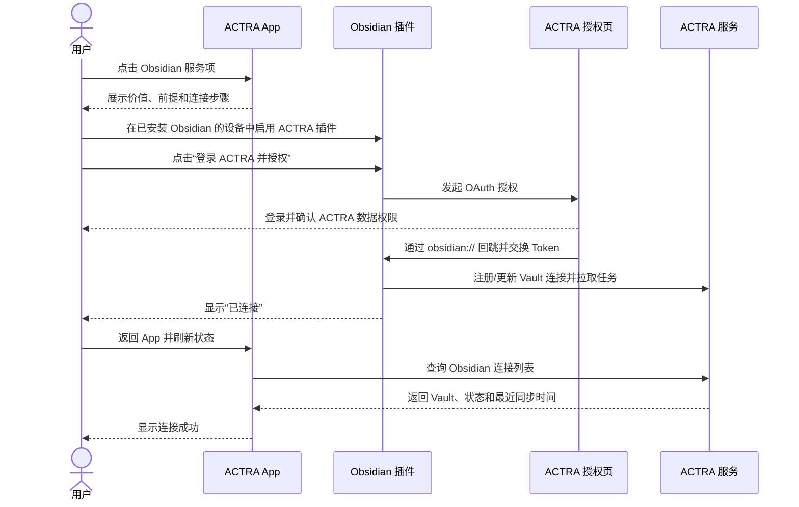

# ACTRA App × Obsidian 连接指南交互方案

> 文档版本：v0.1  
> 更新日期：2026-08-06  
> 文档状态：评审稿  
> 适用对象：产品、交互、视觉、ACTRA App、ACTRA 服务端、Obsidian 插件、测试与安全团队

## 1. 方案结论

在 ACTRA App「应用服务」页将 Obsidian 从“马上开放，敬请期待”改为可进入的服务项。未连接时显示 `+`，点击整行或 `+` 进入 Obsidian 服务详情页；详情页先说明价值、同步边界和连接前提，再用分步指南引导用户前往 Obsidian 插件设置发起 ACTRA OAuth 授权。

生产连接的唯一发起端仍是 **Obsidian 内的 ACTRA 插件**。ACTRA App 在首版承担以下职责：

1. 解释 ACTRA 与 Obsidian 能做什么；
2. 指导安装、启用插件和完成授权；
3. 帮助用户确认连接结果并处理常见问题；
4. 在服务端接口就绪后，展示 Vault、最近同步、权限和异常状态，并提供账号侧解除连接。

ACTRA App 不直接访问本地 Vault，也不代替 Obsidian 插件选择读写目录。

## 2. 背景与问题

### 2.1 截图现状

当前「应用服务」列表中：

- 已连接服务使用图标右下角绿色勾选，并在右侧展示 `…`；
- 未连接服务使用右侧 `+`；
- Obsidian 使用“马上开放，敬请期待”，会被理解为功能不可用，也没有后续操作入口；
- Obsidian 的描述“沉淀笔记、灵感与知识”表达了价值方向，但没有说明数据如何同步、需要安装插件以及本地数据的权限边界。

### 2.2 需要解决的问题

1. 用户不知道应从 ACTRA App 还是 Obsidian 发起连接；
2. 手机端 ACTRA App 与桌面端 Obsidian 可能不在同一设备，不能只依赖 App 深链跳转；
3. OAuth 授权、数据同步、目录读取是三个不同层级的权限，不能合并成一句“授权全部笔记”；
4. Obsidian 关闭时 ACTRA 数据不会写入本地 Vault，需要提前管理预期；
5. 解除连接不能让用户误以为会删除已写入的 Markdown。

## 3. 产品目标与非目标

### 3.1 产品目标

- 让用户在 30 秒内理解连接价值和必要前提；
- 让首次连接用户知道下一步必须在 Obsidian 插件内操作；
- 支持同设备跳转和跨设备手动操作两种路径；
- 明确展示连接、同步和重新授权状态；
- 用最小必要文案讲清数据范围、同步时机和隐私边界；
- 保持与「应用服务」页现有 `+ / 绿色勾选 / …` 交互一致。

### 3.2 非目标

- 不在 ACTRA App 内浏览或编辑本地 Obsidian 文件；
- 不在 App 内选择 Vault 的写入目录或读取目录；
- 不默认读取整个 Vault；
- 不承诺 Obsidian 关闭后仍可写入本地文件；
- 不通过解除连接删除任何本地 Markdown；
- 首版不要求 App 生成配对码，生产流程以 ACTRA OAuth 为准。

## 4. 用户与使用场景

### 场景 A：ACTRA App 和 Obsidian 在同一台移动设备

用户可从指南页尝试打开 Obsidian；进入插件设置后点击“登录 ACTRA 并授权”，在浏览器完成授权并回到 Obsidian。

### 场景 B：ACTRA App 在手机，Obsidian 在电脑

这是首版必须支持的主场景。App 展示清晰的桌面操作路径；用户在电脑端 Obsidian 完成安装和授权，再回到 App 刷新连接状态。不能把“打开 Obsidian”作为唯一主路径。

### 场景 C：已经连接，需要查看状态或排障

用户从 Obsidian 服务项进入详情，查看 Vault 名称、最近同步时间和异常提示。目录与同步配置仍跳转或引导至 Obsidian 插件设置。

## 5. 信息架构

```text
应用服务
└── Obsidian 服务项
    ├── 未连接 → 服务详情
    │   ├── 能力说明
    │   ├── 连接前准备
    │   ├── 连接指南
    │   └── 常见问题
    ├── 连接处理中 → 连接进度/刷新状态
    ├── 已连接 → 连接管理
    │   ├── Vault 与最近同步
    │   ├── 当前能力和权限说明
    │   ├── 前往 Obsidian 管理目录
    │   └── 解除连接
    └── 异常 → 对应修复指南
```

## 6. 列表入口方案

### 6.1 服务项布局

延续截图中的现有结构：

```text
[Obsidian 图标]  Obsidian                         [+]
                 同步记录，连接你的知识库
```

交互要求：

- 整个服务项可点击，点击后进入服务详情；
- 右侧 `+` 与整行点击结果一致，不应只给图标绑定点击热区；
- `+` 的无障碍标签为“连接 Obsidian”；
- 移除“马上开放，敬请期待”；
- 不建议继续保留截图中的红色描边，红框只作为评审标注，不属于正式 UI；
- Obsidian 产品名必须统一拼写为 `Obsidian`，不使用 `Obdisian`。

### 6.2 列表状态

| 状态 | 图标角标 | 右侧操作 | 辅助文案 | 点击结果 |
| --- | --- | --- | --- | --- |
| 未连接 | 无 | `+` | 同步记录，连接你的知识库 | 进入服务详情 |
| 等待授权 | 黄色小圆点 | `继续` 或加载态 | 等待在 Obsidian 完成授权 | 进入连接进度页 |
| 已连接 | 绿色勾选 | `…` | 已连接 · 最近同步时间 | 进入连接管理页 |
| 已暂停 | 灰色暂停角标 | `…` | 同步已暂停 | 进入连接管理页 |
| 需重新授权 | 橙色感叹号 | `!` | 登录已失效，请重新连接 | 进入异常修复页 |
| 离线/暂不可达 | 灰色圆点 | `…` | 暂时无法获取同步状态 | 进入连接管理页，不误报断开 |

列表辅助文案建议只显示一个核心状态，时间可采用“5 分钟前”“昨天 20:30”等短格式。

## 7. 首次连接主流程

逐屏说明页及可直接使用的完整文案见 [`ACTRA-APP-OBSIDIAN-GUIDE-PAGE-COPY.md`](ACTRA-APP-OBSIDIAN-GUIDE-PAGE-COPY.md)。



### 7.1 页面一：Obsidian 服务详情（未连接）

页面目标：先让用户理解价值，再开始连接，不一上来展示长教程。

页面结构：

1. Obsidian 图标、标题和连接状态；
2. 一句话价值说明；
3. 三项能力说明；
4. “连接前请准备”信息卡；
5. 主按钮“开始连接”；
6. 次入口“连接如何工作”；
7. 隐私摘要。

建议线框：

```text
< 应用服务

      [Obsidian]
      Obsidian
      未连接

把 ACTRA 的记录沉淀到 Obsidian，
也可让 ACTRA 查询你明确授权的笔记。

✓ 同步每日总结、录音与灵感
✓ 在 Obsidian 内保存为 Markdown
✓ 按目录授权 ACTRA 查询笔记

[连接前请准备]
· 已安装 Obsidian 1.11.4 或更高版本
· 已安装并启用 ACTRA 插件
· 请在安装 Obsidian 的设备上完成连接

[开始连接]
连接如何工作  >

ACTRA 不会默认读取整个 Vault。
```

### 7.2 页面二：连接前检查

用户点击“开始连接”后，先确认插件状态：

```text
连接 Obsidian

你是否已安装并启用 ACTRA 插件？

[已安装，查看连接步骤]
[还没有，查看安装方法]
```

说明：首版无法可靠检测另一台设备上的插件安装状态，不要设计伪检测或自动勾选。

### 7.3 页面三 A：插件安装指南

步骤建议：

1. 打开 Obsidian，进入需要连接的 Vault；
2. 进入“设置 → 第三方插件”；
3. 如果当前处于受限模式，点击“退出受限模式”并确认；
4. 点击“浏览”，进入社区插件市场；
5. 搜索 `ACTRA` 并打开插件详情；
6. 点击“安装”，安装完成后点击“启用”；
7. 打开“设置 → ACTRA”。

页面操作：

- 主按钮：“我已安装，继续连接”；
- 次按钮：“打开 Obsidian”（仅同设备且系统支持时展示）；
- 文本操作：“复制插件名称”；
- 可选增强：“发送步骤到电脑”或展示帮助页二维码，供跨设备使用。

如果插件尚未正式进入 Obsidian 社区插件市场，安装文案必须切换为开发版安装路径，不得让用户搜索一个不存在的公开插件。正式上线前应由发布配置控制该段文案。

### 7.4 页面三 B：连接指南

```text
在 Obsidian 中完成连接

1  打开“设置 → ACTRA”
2  点击“登录 ACTRA 并授权”
3  在浏览器中确认授权
4  返回 Obsidian，等待显示“已连接”

[打开 Obsidian]
[检查连接状态]

使用电脑端 Obsidian？请在电脑上按以上步骤操作，
完成后回到这里检查状态。
```

交互规则：

- 点击“打开 Obsidian”后，App 保留当前页面，用户返回时自动触发一次状态查询；
- App 进入前台时只查询一次，不持续高频轮询；
- 点击“检查连接状态”时展示按钮内加载态；
- 查询超过 10 秒仍无结果，提示用户检查 Obsidian 内是否已经显示“已连接”；
- 不显示虚假的百分比进度，因为 App 无法知道用户在外部页面执行到哪一步。

### 7.5 外部 ACTRA OAuth 授权页

授权页不是 App 页面，但必须与 App 指南使用同一套术语。

必须展示：

- 当前登录的 ACTRA 账号；
- 请求方：“ACTRA for Obsidian”；
- 申请同步的 ACTRA 数据类别；
- “不会因此读取整个 Vault”的说明；
- “Obsidian 笔记目录将在插件中另行选择”的说明；
- 同意与取消操作；
- 隐私政策与服务条款入口。

当前插件申请的 OAuth scope 为 `dailylog note recording`。在 scope 未扩展前，授权页和 App 不应宣称 OAuth 已包含运动、待办状态回写或附件同步。

### 7.6 页面四：连接结果

成功：

```text
Obsidian 已连接

ACTRA 内容将在你打开 Obsidian 时自动拉取，
你也可以在 ACTRA 插件中手动拉取。

Vault：{vault_name}
写入目录：请前往 Obsidian 查看

[完成]
[查看连接设置]
```

未查询到连接：

```text
暂未检测到连接

请确认 Obsidian 的 ACTRA 设置页已经显示“已连接”。
如果刚完成授权，可以稍后再试。

[重新检查]
[查看排查方法]
```

这里使用“暂未检测到”，不要直接使用“连接失败”，因为跨设备状态同步可能有延迟。

## 8. 已连接管理方案

### 8.1 页面内容

```text
< 应用服务                    …

      [Obsidian ✓]
      已连接

[Vault 卡片]
产品知识库
最近同步：今天 19:32
状态：同步正常

ACTRA → Obsidian
每日总结、笔记、录音
仅在打开 Obsidian 后拉取

Obsidian → ACTRA
读取范围：请在 Obsidian 中查看和管理
自动上传：{每 24 小时 / 已关闭 / 状态未知}

[在 Obsidian 中管理]
同步如何工作  >
常见问题      >
解除连接      >
```

### 8.2 多 Vault

一个 ACTRA 账号可能连接多个 Vault。App 需要以 Vault 连接为管理单位：

- 服务列表只展示聚合状态，例如“已连接 2 个 Vault”；
- 详情页展示 Vault 卡片列表；
- Vault 名称相同时，补充设备名称或插件实例简称进行区分；
- 每个 Vault 单独显示状态、最近同步和解除连接入口；
- 解除其中一个 Vault 不影响其他 Vault。

### 8.3 App 与插件的管理边界

| 设置项 | ACTRA App | Obsidian 插件 |
| --- | --- | --- |
| 查看连接状态 | 支持 | 支持 |
| 查看 Vault 名称 | 支持 | 支持 |
| 查看最近同步时间 | 支持 | 支持 |
| 手动拉取到本地 | 不支持 | 支持 |
| 设置 ACTRA 写入目录 | 不支持 | 支持 |
| 添加/移除读取目录 | 不支持 | 支持，逐目录确认 |
| 每 24 小时自动上传 | 仅展示状态 | 支持，默认开启且可关闭 |
| 手动上传 | 不支持 | 支持，不受自动上传开关影响 |
| 暂停同步 | 可作为增强项 | 支持 |
| 账号侧撤销连接 | 支持，需服务端接口 | 本地清除 Token |
| 删除本地 Markdown | 永不支持 | 永不支持 |

## 9. 异常与恢复流程

| 场景 | 标题 | 说明 | 主操作 |
| --- | --- | --- | --- |
| OAuth 被用户取消 | 未完成授权 | 你已取消授权，ACTRA 与 Obsidian 尚未连接。 | 重新连接 |
| Token 失效 | 需要重新连接 | 登录凭据已失效，请在 Obsidian 中重新授权。 | 查看重新连接步骤 |
| App 查询超时 | 暂时无法获取状态 | 网络可能不稳定，你的本地笔记不会受到影响。 | 重试 |
| Obsidian 未安装 | 需要先安装 Obsidian | ACTRA 通过 Obsidian 插件完成本地同步。 | 查看安装方法 |
| 插件未安装/未启用 | 需要启用 ACTRA 插件 | 请在 Obsidian 的第三方插件设置中安装并启用 ACTRA。 | 查看插件安装步骤 |
| Obsidian 未打开 | 等待打开 Obsidian | 待同步内容会保留，打开 Obsidian 后再由插件拉取。 | 我知道了 |
| 同步暂停 | 同步已暂停 | 待同步内容会继续保留，本地文件不会改变。 | 在 Obsidian 中恢复 |
| 局部任务失败 | 部分内容尚未同步 | 请打开 Obsidian，在 ACTRA 插件中查看同步状态并重试。 | 查看处理方法 |
| App 状态与插件不一致 | 状态可能有延迟 | 以 Obsidian 插件内显示的本地连接和同步结果为准。 | 重新检查 |

## 10. 解除连接

### 10.1 操作位置

- 放在已连接 Vault 详情页底部；
- 不与“在 Obsidian 中管理”并列为同等强调的主按钮；
- 点击后必须二次确认；
- 多 Vault 场景必须在确认框中显示具体 Vault 名称。

### 10.2 确认文案

标题：`解除“{vault_name}”的连接？`

正文：

`解除后，ACTRA 将停止与此 Vault 同步，并撤销该连接的账号授权。已经写入 Obsidian 的 Markdown 会完整保留。`

按钮：

- 主操作（警示色）：`解除连接`
- 次操作：`取消`

如果服务端暂未提供 Token 撤销接口，ACTRA App 不应上线一个只改变 UI 状态的“解除连接”按钮。首版可以只展示“请前往 Obsidian 解除连接”，待撤权接口完成后再开放 App 操作。

## 11. 文案需求

### 11.1 文案原则

1. **先说用户收益，再说技术步骤。** 不在 App 首屏出现 OAuth、Token、scope 等开发术语。
2. **明确动作发生在哪里。** 使用“在 Obsidian 中”“返回 ACTRA App”等位置词，降低跨应用迷失。
3. **区分三类行为。** 使用“连接账号”“同步 ACTRA 内容”“授权读取目录”，不笼统写“授权数据”。
4. **不夸大实时性。** 使用“打开 Obsidian 后拉取”，不使用“实时同步”“自动推送到本地”。
5. **不夸大读取范围。** 使用“你明确授权的目录”，不使用“访问你的 Obsidian”或“读取全部知识库”。
6. **强调可逆和本地保留。** 解除连接、暂停、失败时统一说明本地文件不会被删除。
7. **状态文案描述事实。** 无法确定失败时使用“暂未检测到”“状态可能有延迟”，避免误判。
8. **产品名统一。** 始终使用 `ACTRA`、`Obsidian`、`Vault`；首次出现 Vault 时可补充“知识库（Vault）”。

### 11.2 字数与组件要求

| 组件 | 建议上限 | 要求 |
| --- | --- | --- |
| 服务列表标题 | 12 个字符 | 固定为 Obsidian |
| 服务列表描述 | 18 个汉字 | 一行优先，表达价值而非状态 |
| 列表状态 | 12 个汉字 | 状态 + 必要时间，不换行 |
| 页面标题 | 16 个汉字 | 使用动宾结构或明确状态 |
| 页面说明 | 50 个汉字 | 最多 2～3 行 |
| 主按钮 | 10 个汉字 | 每页只设一个首要动作 |
| Toast | 30 个汉字 | 说清结果，必要时给下一步 |
| 确认弹窗正文 | 80 个汉字 | 同时说明影响和不受影响内容 |

### 11.3 推荐核心文案

| 位置 | 推荐文案 |
| --- | --- |
| 列表描述 | 同步记录，连接你的知识库 |
| 未连接状态 | 未连接 |
| 详情页价值句 | 把 ACTRA 的记录沉淀到 Obsidian，也可让 ACTRA 查询你明确授权的笔记。 |
| 主按钮 | 开始连接 |
| 安装分流标题 | 你是否已安装并启用 ACTRA 插件？ |
| 已安装操作 | 已安装，查看连接步骤 |
| 未安装操作 | 还没有，查看安装方法 |
| 插件内操作提示 | 打开“设置 → ACTRA”，点击“登录 ACTRA 并授权”。 |
| 同设备跳转 | 打开 Obsidian |
| 跨设备提示 | 使用电脑端 Obsidian？请在电脑上按以上步骤操作，完成后回到这里检查状态。 |
| 状态查询 | 检查连接状态 |
| 查询中 | 正在检查… |
| 成功标题 | Obsidian 已连接 |
| 成功说明 | ACTRA 内容将在你打开 Obsidian 时自动拉取，也可在插件中手动拉取。 |
| 未检测到标题 | 暂未检测到连接 |
| 未检测到说明 | 请确认 Obsidian 的 ACTRA 设置页已经显示“已连接”。 |
| 重新授权 | 登录已失效，请重新连接 |
| 离线 | 暂时无法获取同步状态 |
| 暂停 | 同步已暂停 |
| 解除连接提示 | 已写入 Obsidian 的 Markdown 会完整保留。 |

### 11.4 不建议使用的文案

| 不建议 | 原因 | 建议替换 |
| --- | --- | --- |
| 马上开放，敬请期待 | 功能上线后成为错误状态，且无动作 | `+` / 未连接 |
| 一键连接 Obsidian | 实际还需要插件安装、OAuth 和回跳 | 开始连接 |
| 实时同步到 Obsidian | Obsidian 关闭时不会写入本地 | 打开 Obsidian 后自动拉取 |
| 授权访问知识库 | 范围含糊，容易理解成整个 Vault | 授权读取你选择的目录 |
| ACTRA 会自动读取笔记 | 默认不会读取，且需独立开启云端索引 | ACTRA 可查询你明确授权的笔记 |
| 断开后清除数据 | 容易误解为删除本地文件 | 停止同步，本地 Markdown 保留 |
| 连接失败 | 状态延迟时可能误判 | 暂未检测到连接 |

## 12. 服务端与客户端依赖

### 12.1 MVP：只上线指南

不依赖新的连接管理接口，可以先完成：

- 应用服务列表入口；
- 服务价值说明；
- 插件安装指南；
- Obsidian 内 OAuth 操作步骤；
- 同设备打开 Obsidian；
- 常见问题与隐私说明。

此版本无法在 App 内可靠显示“已连接”，完成页应使用“我已完成”或引导用户以 Obsidian 插件状态为准。

### 12.2 完整状态版

服务端至少需要提供以下逻辑能力，具体 URL 可由后端统一定义：

1. 查询当前 ACTRA 账号的 Obsidian Vault 连接列表；
2. 返回 `connection_id`、Vault 显示名称、插件实例/设备标识、连接状态、暂停状态、授权 scope、最近成功拉取时间、最近索引时间；
3. 对单个连接执行账号侧撤销，并立即使对应 Token 失效；
4. 区分未同步、同步延迟、需重新认证和已撤销；
5. 保证 App 展示的 Vault 名称经过长度限制和安全转义；
6. 不向 App 返回本地绝对路径、完整目录树或笔记正文；
7. 连接状态更新允许短暂最终一致，但应返回服务端更新时间供 App 判断陈旧状态。

建议数据模型：

```json
{
  "connections": [
    {
      "connectionId": "vault_xxx",
      "vaultName": "产品知识库",
      "deviceName": "MacBook Pro",
      "status": "CONNECTED",
      "paused": false,
      "scopes": ["dailylog", "note", "recording"],
      "cloudIndexEnabled": false,
      "lastSuccessfulSyncAt": "2026-08-06T11:32:00Z",
      "lastIndexSyncAt": null,
      "updatedAt": "2026-08-06T11:32:02Z"
    }
  ]
}
```

## 13. 埋点建议

埋点不得包含 Vault 路径、笔记标题、正文、Token 或授权目录名。

| 事件 | 触发时机 | 建议参数 |
| --- | --- | --- |
| `obsidian_service_view` | 进入服务详情 | `connection_state` |
| `obsidian_connect_start` | 点击开始连接 | `platform` |
| `obsidian_install_guide_view` | 进入安装指南 | `platform` |
| `obsidian_open_attempt` | 点击打开 Obsidian | `platform`, `open_result` |
| `obsidian_steps_view` | 查看连接步骤 | `same_device_hint` |
| `obsidian_status_check` | 手动检查状态 | `result`, `latency_bucket` |
| `obsidian_connect_detected` | App 首次检测到连接 | `vault_count` |
| `obsidian_troubleshoot_view` | 打开排障 | `reason_code` |
| `obsidian_disconnect_start` | 点击解除连接 | `connection_state` |
| `obsidian_disconnect_result` | 解除完成 | `result`, `reason_code` |

核心漏斗：

`服务项曝光 → 服务详情 → 开始连接 → 查看连接步骤 → OAuth 成功 → App 检测到连接 → 首次成功拉取`

## 14. 验收标准

### 14.1 交互验收

- Obsidian 服务项可整行点击，右侧不再显示“马上开放”；
- 未连接、处理中、已连接、暂停、需重连和离线状态有明确且互不冲突的展示；
- 用户始终能判断下一步是在 ACTRA App、Obsidian 还是浏览器完成；
- 跨设备用户无需依赖深链也能完成连接；
- 返回 App 后可手动刷新状态，加载和超时反馈完整；
- 多 Vault 可以分别识别和管理；
- App 不提供目录选择或手动写入 Vault 的伪入口。

### 14.2 文案与安全验收

- 所有位置统一拼写 `Obsidian`；
- 不出现“实时同步”“默认读取整个 Vault”等错误承诺；
- 明确说明同步只在 Obsidian 打开后拉取，或由插件手动拉取；
- 明确说明读取目录需要在插件内单独授权；
- 明确说明解除连接不会删除已写入的 Markdown；
- OAuth 授权页展示的能力与实际 scope 一致；
- 埋点和 App 接口不包含笔记内容、本地绝对路径或 Token；
- 无服务端撤权能力时不开放误导性的 App 解除按钮。

### 14.3 上线前确认项

- Obsidian 社区插件是否已经公开可搜索；
- 最低 Obsidian 版本是否仍为 1.11.4；
- iOS、Android、macOS、Windows 的 Obsidian 打开方式及失败兜底；
- 生产 OAuth 服务地址、Client ID、回调地址和 S256 PKCE 支持；
- App 连接列表和 Token 撤销接口是否就绪；
- ACTRA 隐私政策、服务条款及 Obsidian 集成帮助页 URL；
- scope 是否仍为 `dailylog note recording`，若扩展需同步更新全部授权文案。

## 15. 分期建议

### P0：连接指南上线

- 替换“马上开放，敬请期待”；
- 上线未连接详情、安装指南、连接步骤和常见问题；
- 提供同设备打开 Obsidian 和跨设备操作说明；
- 以 Obsidian 插件内状态作为连接成功依据。

### P1：状态回显

- 接入连接列表；
- 展示 Vault、最近同步、暂停和重新授权状态；
- App 返回前台自动检查一次连接状态。

### P2：完整连接管理

- 多 Vault 管理；
- 账号侧撤销 Token；
- 最近错误的分级排障；
- 可选“发送指南到电脑”或帮助页二维码。
